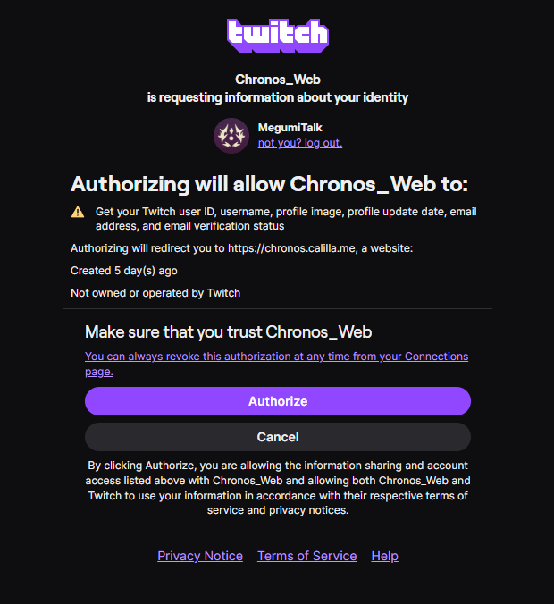

# Chronos — backend

Questo repository contiene **solo il backend** di [Chronos](https://chronos.calilla.me),
il sito della community del canale Twitch di MegumiTalk, e la documentazione di come
si collega a Twitch.

Lo scopo è permettere a chiunque abbia dubbi su come il sito utilizzi l'autenticazione di Twitch di poter verificare e assicurarsi autonomamente di ciò che accade dietro le quinte, invece di doversi semplicemente fidare sulla parola.

### In breve

L'autenticazione di Chronos avviene tramite i sistemi OAuth 2.0 e OpenID Connect (OIDC) messi a disposizione da Twitch. Chronos **non riceve né ha accesso alla password Twitch** dell'utente: Twitch trasmette a Chronos un token di accesso che permette al sito di effettuare esclusivamente le operazioni autorizzate e i dati necessari all'identificazione dell'utente.

I dati del profilo che possono essere utilizzati da Chronos sono:

1. **Twitch User ID** — l'identificativo univoco dell'account Twitch.
2. **Username** — il nome associato all'account Twitch.
3. **Immagine del profilo** — l'URL dell'immagine del profilo.
4. **Data di aggiornamento del profilo** — la data e l'ora dell'ultimo aggiornamento del profilo, quando fornita tramite OIDC.
5. **Indirizzo email** — l'indirizzo email verificato associato all'account, disponibile tramite l'autorizzazione `user:read:email`.
6. **Stato di verifica dell'email** — un'indicazione che specifica se l'indirizzo email risulta verificato da Twitch.

Questi dati vengono utilizzati per permettere a Chronos di identificare l'utente e fornire le funzionalità che richiedono l'integrazione con Twitch. Chronos non richiede né riceve la password dell'account Twitch.

Per quanto riguarda i permessi, Chronos dovrebbe richiedere esclusivamente gli scope necessari alle funzionalità effettivamente utilizzate. Twitch stessa raccomanda alle applicazioni di richiedere solamente i permessi indispensabili al loro funzionamento.

## Da dove partire

- **[`docs/twitch-api.md`](docs/twitch-api.md)** — ogni chiamata alle API di Twitch, con
  quale token viene fatta, cosa restituisce e cosa di quel dato finisce nel database.
- `src/auth.ts` — il login. L'unico permesso richiesto all'utente è `openid`.
- `src/lib/twitch/helix.ts` — tutte le richieste uscenti verso Twitch.
- `src/lib/twitch/eventsub.ts` — verifica della firma dei webhook.
- `src/db/schema.ts` — lo schema del database: quello che viene salvato è tutto lì.

## Cosa non c'è

- Il frontend, la grafica e le pagine del sito.
- Le medaglie e gli artwork: appartengono a MegumiTalk e ai rispettivi autori.
- Qualsiasi segreto, chiave o credenziale: le variabili d'ambiente sono solo nominate.

## Licenza e uso
Chronos, il suo nome,
la sua grafica e le sue medaglie appartengono a MegumiTalk; non è autorizzata la replica
del sito, né in tutto né in parte.

Chronos è un progetto fan-made, indipendente e non commerciale. Non è affiliato,
sponsorizzato o approvato da Twitch né dagli sviluppatori, publisher o titolari delle
proprietà intellettuali rappresentate nelle medaglie.

## Segnalazioni

Per questioni di copyright o proprietà intellettuale c'è un modulo dedicato, che non
richiede alcun account: <https://chronos.calilla.me/contatti>.
